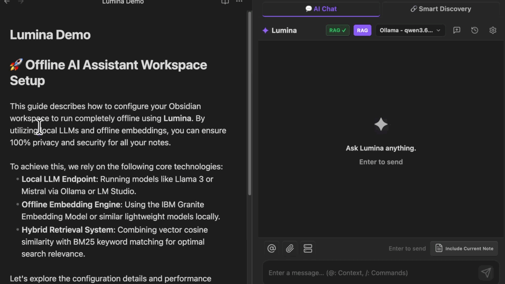

# 🚀 Lumina : Assistant IA Tout-en-Un (RAG + MCP + Agent)

**`Lumina` est un puissant plugin assistant tout-en-un pour Obsidian qui transforme votre base de connaissances en un véritable hub IA, combinant la prise en charge multi-LLM, un RAG sans configuration, une intégration MCP bidirectionnelle et des agents IA autonomes.**

  <a href="https://github.com/lumina-apps/obsidian-lumina/blob/main/README.md">English</a> | <a href="https://github.com/lumina-apps/obsidian-lumina/blob/main/docs/README_KO.md">한국어</a> | <a href="https://github.com/lumina-apps/obsidian-lumina/blob/main/docs/README_JA.md">日本語</a> | <a href="https://github.com/lumina-apps/obsidian-lumina/blob/main/docs/README_ZH.md">简体中文</a> | <a href="https://github.com/lumina-apps/obsidian-lumina/blob/main/docs/README_ZH_TW.md">繁體中文</a> | <a href="https://github.com/lumina-apps/obsidian-lumina/blob/main/docs/README_ES.md">Español</a> | <a href="https://github.com/lumina-apps/obsidian-lumina/blob/main/docs/README_DE.md">Deutsch</a> | <b>Français</b> | <a href="https://github.com/lumina-apps/obsidian-lumina/blob/main/docs/README_PT.md">Português</a> | <a href="https://github.com/lumina-apps/obsidian-lumina/blob/main/docs/README_RU.md">Русский</a> | <a href="https://github.com/lumina-apps/obsidian-lumina/blob/main/docs/README_IT.md">Italiano</a>

> 🌐 **Optimisé pour les Environnements Multilingues !** Les modèles d'intégration (embeddings) intégrés et l'interface utilisateur sont entièrement localisés pour les environnements multilingues. (Les retours sur la traduction sont toujours les bienvenus !)

---

## 🌟 Fonctionnalités Principales

| Fonctionnalité | Description |
| :--- | :--- |
| **💬 Vue de Chat Multi-LLM** | Un panneau latéral dédié qui comprend le contexte de vos notes. Prend en charge des modèles cloud puissants jusqu'aux LLM locaux pour un maximum de confidentialité. |
| **🧠 RAG Sans Configuration** | Propose des intégrations locales (embeddings) 100% hors ligne pour éviter les fuites de données. Indexe automatiquement votre coffre-fort en temps réel sans configurations complexes. |
| **🔗 Smart Discovery** | Trouve instantanément des documents hautement pertinents pour la note en cours de rédaction grâce à la recherche sémantique, détecte et signale les doublons potentiels, et insère des tags recommandés et des liens associés en un clic. |
| **⚡ Actions Rapides IA en Ligne** | Surlignez du texte dans l'éditeur pour résumer, traduire ou corriger instantanément, sans interrompre votre flux de rédaction. |
| **🚀 Mode Agent Intelligent** | Les LLM planifient et exécutent de manière autonome des tâches complexes telles que la recherche, la création, la modification, la suppression/déplacement de notes et l'exécution de code dans un bac à sable en utilisant 23 outils MCP intégrés. |
| **🔌 Intégration MCP (Client & Serveur)** | Une intégration bidirectionnelle et complète (full-stack) qui vous permet d'utiliser des outils externes dans Obsidian (Client) ou de laisser des IA externes interagir avec vos notes (Serveur). |

---

## ⚡ Démarrage Rapide

Lumina propose deux modes adaptés à votre niveau. Choisissez celui qui vous convient !

### 🟢 Piste 1 : Démarrez en 3 étapes (Recommandé pour les Débutants)
1. Installez et activez Lumina.
2. Allez dans Paramètres > Lumina et saisissez votre **clé API gratuite (Gemini ou Groq)** obtenue via les liens ci-dessous.
   - 👉 [Obtenir une Clé API Google Gemini (Gratuit)](https://aistudio.google.com/app/apikey)
   - 👉 [Obtenir une Clé API Groq (Gratuit)](https://console.groq.com/keys)
3. Ouvrez n'importe quelle note et posez une question à Lumina dans le panneau latéral droit. C'est tout ! (Une fois l'indexation RAG locale terminée dans le panneau latéral, les conversations basées sur vos notes seront immédiatement activées.)

### 🔵 Piste 2 : Maîtrisez l'Agent (Recommandé pour les Utilisateurs Avancés)
1. Connectez un LLM local ou votre IA cloud préférée dans les paramètres.
2. Tapez `/mcp` dans le chat pour activer le **Mode Agent Intelligent**.
3. Donnez des commandes autonomes comme : « Trouve tous les comptes rendus de réunion de cette semaine dans mon coffre et compile-les en un seul fichier de résumé. »

> [!IMPORTANT]
> **🔒 Stockage Sécurisé des Clés API**
> Toutes les clés API que vous entrez ne sont jamais stockées sous forme de fichiers texte en clair. Elles sont cryptées de manière sécurisée et stockées localement via le `SecretStorage` intégré d'Obsidian, garantissant ainsi la sécurité de vos données.

---

## ✨ Fonctionnalités Détaillées & Utilisation (Cliquez pour Développer)

<b>💬 Vue de Chat Multi-LLM (Prise en charge Cloud & Locale)</b>

- **Description :** Discutez instantanément avec divers modèles d'IA via un panneau latéral dédié à l'intérieur d'Obsidian. Prend entièrement en charge des modèles cloud puissants comme Gemini et Groq, ainsi que des **LLM Locaux** (Ollama, LM Studio, etc.) pour une confidentialité absolue.
- **Comment utiliser :** Cliquez sur l'icône 💬 sur le ruban gauche ou exécutez `Lumina: Open Chat` depuis la palette de commandes.
- **💡 Astuce Pro :** Surlignez du texte dans l'éditeur, faites un clic droit, et utilisez le menu contextuel pour injecter directement le texte sélectionné dans le chat comme contexte pour vos questions !

<b>🧠 Chat Basé sur RAG & Intégrations Locales (Confidentialité Absolue)</b>

- **Description :** L'IA obtient une vision approfondie de votre base de connaissances. Elle recherche de manière autonome les notes pertinentes pendant les conversations et affiche les documents similaires ainsi que les balises recommandées dans le panneau latéral, créant des liens contextuels intelligents.
- **Sécurité Hors Ligne :** Prend en charge nativement les intégrations (embeddings) locales (`ibm-granite`). À moins qu'un modèle cloud ne soit sélectionné, vos précieuses données de notes ne quitteront jamais votre appareil.
- **Entièrement Automatisé :** Aucune configuration requise ! L'indexation en arrière-plan démarre discrètement dès que le plugin est activé, et se synchronise automatiquement en temps réel (mode `watch`) chaque fois que les notes sont modifiées.

<b>🔗 Smart Discovery</b>

- **Description:** Basé sur le moteur RAG, il visualise les informations hautement pertinentes pour la note en cours de rédaction directement dans l'onglet « Smart Discovery » du panneau latéral.
- **Caractéristiques principales:**
  - **Recherche sémantique:** Au-delà d'une simple correspondance de mots-clés, il analyse le contexte et le sens de la phrase saisie pour rechercher des notes similaires.
  - **Détection de doublons:** Affiche un avertissement si un document au contenu très similaire existe déjà dans votre coffre pour éviter la fragmentation et la duplication d'informations.
  - **Tags recommandés et notes associées:** Analyse le contexte de la note en cours pour recommander des tags appropriés et suggérer des notes associées en temps réel.
  - **Intégration et chat en un clic:** Insérez des tags recommandés ou des notes associées dans votre document sous forme de tags ou de liens markdown (`[[Nom de la note]]`) en un seul clic, ou préparez les notes sélectionnées dans la zone de préparation pour démarrer immédiatement un chat IA.
- **Utilisation:** Cliquez sur l'icône 💬 dans le ruban de gauche pour ouvrir le panneau latéral, puis passez à l'onglet 🔗 (Smart Discovery) en haut.

<b>⚡ IA Éditeur en Ligne (Actions Rapides)</b>

- **Description :** Transformez instantanément du texte dans l'éditeur markdown sans interrompre votre flux de rédaction. Gérez facilement la traduction, la synthèse, la correction grammaticale et les explications détaillées pour le texte sélectionné.
- **Comment utiliser :** Surlignez le texte et exécutez les Actions Rapides via le menu contextuel en ligne ou la palette de commandes. *(💡 Astuce : Attribuez des raccourcis clavier dans les paramètres d'Obsidian pour un accès ultra-rapide !)*

<b>🚀 Mode Agent Intelligent</b>

- **Description:** Une fois activé, le LLM détermine et orchestre de manière autonome 23 outils MCP intégrés pour effectuer des tâches. Il peut réaliser des opérations complexes en plusieurs étapes en combinant la recherche, la lecture et l'écriture de notes, la récupération RAG, l'exécution de code dans un bac à sable et l'intégration de notes quotidiennes.
- **Support LLM local:** Implémente un analyseur dédié qui prend en charge le prompt d'outils textuels, permettant à l'agent de fonctionner de manière fluide même dans des environnements LLM locaux, et pas seulement avec des modèles cloud haute performance.
- **Sécurité robuste et contrôle de l'utilisateur (Human-in-the-Loop):** Les opérations destructrices telles que la modification de contenu, la suppression de fichiers ou l'exécution de code ne peuvent pas être traitées par l'agent seul. Elles sont exécutées en toute sécurité avec des sauvegardes de protection contre l'écriture uniquement après avoir invité l'utilisateur avec une interface graphique (visualiseur de différences et fenêtre d'avertissement de tâche) et reçu l'approbation finale (Accepter).
- **Prévention des coûts et limites:** Des limites par défaut sur le nombre d'utilisations des outils et la longueur des caractères ajoutés sont appliquées pour éviter les dysfonctionnements de l'IA ou les boucles infinies. (Ces limites peuvent être ajustées librement dans les paramètres avancés).
- **Utilisation:** Saisissez la commande `/mcp` dans le chat ou cliquez sur l'icône supérieure pour ouvrir le pop-up rapide et activer le « Mode Agent ». (Le serveur interne de Lumina démarrera automatiquement si nécessaire pour exécuter les outils).

<b>🔌 Intégration MCP (Support client & serveur bidirectionnel)</b>

- **Description :** Relie de manière transparente Obsidian au vaste écosystème de l'IA via le Model Context Protocol (MCP). Utilisez Obsidian comme un hub IA tout-en-un, ou tirez-en parti comme le second cerveau de votre IA !
- **💻 Mode Client (Dirigé par Obsidian) :**
  - Interagissez et travaillez directement avec l'IA au sein d'Obsidian.
  - Connectez de nombreux serveurs MCP externes (GitHub, bases de données locales, recherche web, etc.) pour extraire et organiser instantanément de vastes quantités de données dans vos notes.
- **🖥️ Mode Serveur (Dirigé par une IA Externe) :**
  - Fournit 23 outils permettant à des assistants IA externes (Claude, Cursor, etc.) ou à l'IA en Mode Agent d'accéder directement à votre coffre-fort.
  - **Lecture & Recherche :** `read_active_note`, `read_note`, `search_notes` (prend en charge le filtrage par tags), `list_notes`, `rag_search`, `get_backlinks`, `get_note_metadata`, `list_attachments`, `list_tags` pour fournir un contexte étendu à l'IA.
  - **Écriture & Modification :** `create_note`, `append_to_note`, `replace_note`, `patch_note`, `update_frontmatter`, `save_attachment`, `create_canvas`, `generate_moc` (créer/modifier des notes/canevas (canvas), générer des notes MOC (Map of Content) et sauvegarder des fichiers binaires).
  - **Gestion & Exécution :** `delete_note`, `move_note` (déplacer/renommer), `execute_code`, `run_note_code_block` (exécuter du code dans un bac à sable).
- **Remarque:** *Lumina intègre des mécanismes de sécurité multicouches, notamment l'exécution de code en bac à sable, des approbations utilisateur basées sur un visualiseur de différences en temps réel (Human-in-the-Loop), des sauvegardes automatiques lors des modifications de fichiers (protection contre l'écriture) et des limites pour éviter les boucles infinies. Cependant, comme l'agent et les IA externes accèdent directement à votre coffre, nous vous recommandons de surveiller de près les opérations au début.*
  - **Sécurité Robuste & Contrôle Utilisateur :** Les opérations destructives telles que la modification de contenu, la suppression de fichiers ou l'exécution de code ne peuvent pas être traitées par l'agent seul. Elles sont exécutées en toute sécurité avec des sauvegardes de protection contre l'écrasement uniquement après avoir invité l'utilisateur via une interface (Visualiseur de Différences et Fenêtre Modale d'Avertissement de Tâche) et avoir reçu l'approbation finale (Accept).
- **Comment utiliser :** Activez les fonctionnalités MCP dans les paramètres du plugin et configurez la méthode de transport client/serveur (SSE).
- **Remarque:** *Lumina intègre des mécanismes de sécurité multicouches, notamment l'exécution de code en bac à sable, des approbations utilisateur basées sur un visualiseur de différences en temps réel (Human-in-the-Loop), des sauvegardes automatiques lors des modifications de fichiers (protection contre l'écriture) et des limites pour éviter les boucles infinies. Cependant, comme l'agent et les IA externes accèdent directement à votre coffre, nous vous recommandons de surveiller de près les opérations au début.*

---

## 🐛 Mode Débogage & Rapports de Bugs

Vous pouvez afficher toutes les données internes traitées par le plugin en activant les Paramètres Avancés et en cochant le [Mode Débogage] sous l'onglet [Add-ons & Divers] dans les paramètres. (Les journaux de débogage ne sont sauvegardés qu'une fois téléchargés).

**💡 Informations Utiles pour la Résolution :**
- Votre système d'exploitation (Windows, macOS, Linux) et la version d'Obsidian.
- Le Fournisseur d'IA et le Nom du Modèle utilisé (ex. : OpenAI / gpt-4o, Ollama / llama3).
- Le fichier journal téléchargé après l'apparition de l'erreur en Mode Débogage.
> [!IMPORTANT]
> Les fichiers journaux pouvant contenir des transcriptions de chat, veuillez supprimer toute information sensible avant de soumettre.
> **[Signaler un Bug (GitHub Issues)](https://github.com/lumina-apps/obsidian-lumina/issues)**

---

## ☕ Soutien & Sponsoring

Ce plugin est distribué 100% gratuitement et sera continuellement mis à jour.
 
👉 **[Ko-fi](https://ko-fi.com/luminaapps)**  
👉 **[Ctee](https://ctee.kr/place/luminaapps)**